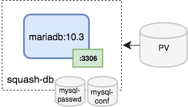
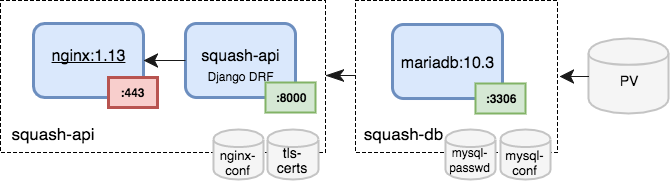
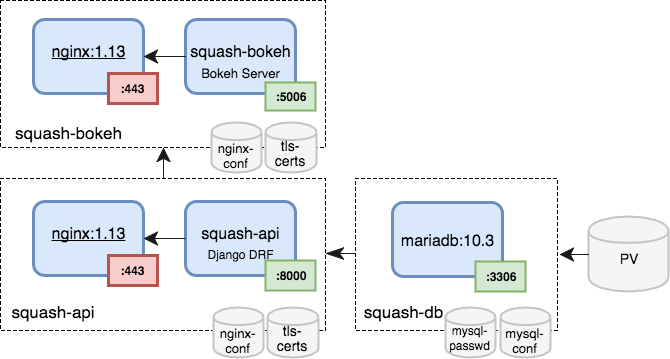
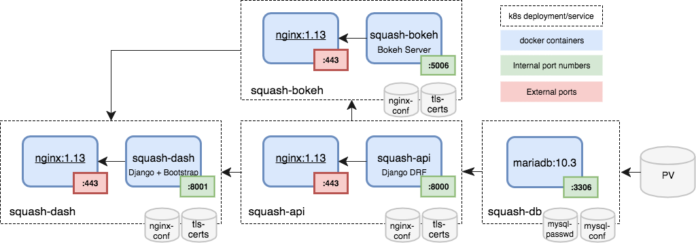

# squash-deployment
Manage the deployment of the squash microservices.


## SQuaSH microservices deployment

[squash-deployment](https://github.com/lsst-sqre/squash-deployment) will clone the repositories for the individual squash microservices, set the appropriate 
namespaces, create the secrets and deploy the microservices in the right order.

## Deploy the SQuaSH DB

```
  make squash-db
```




## Create the `tls-certs` secret

`tls-certs` are used by the [squash-api](https://github.com/lsst-sqre/squash-api), [squash-bokeh](https://github.com/lsst-sqre/squash-bokeh) and the [squash-dash](https://github.com/lsst-sqre/squash-dash) microservices which use `nginx` as reverse proxy. 

Download the `lsst-certs.git` repo from the [lsst-square](https://www.dropbox.com/home/lsst-sqre) Dropbox folder, it has the SSL key and certificates to secure
 traffic on `*.lsst.codes` services. 

```
  make tls-certs
```

## Deploy the SQuaSH API
```
  make squash-api 
```




## Deploy the Bokeh Server 
```
  make squash-bokeh
```




## Deploy the SQuaSH dashboard

```
  make squash-dash
```


